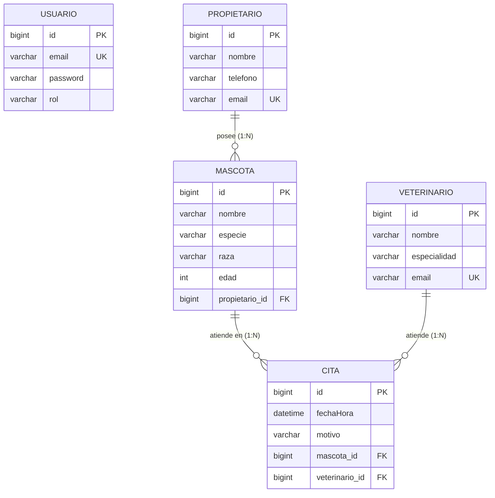

# VetTurno — Sistema de Gestión de Turnos y Citas

> API REST desarrollada con **Java 17** y **Spring Boot** para la digitalización y gestión operativa de citas médicas en **Veterinaria Huellitas**.

---

## 1. Historia

Hace seis años, doña Marta fundó **Veterinaria Huellitas** con la misión de brindar atención médica de calidad y trato compasivo a los animales de compañía de la comunidad. Con el crecimiento constante del consultorio, el equipo incorporó al **Dr. Andrés** como médico veterinario y a **Paula** en el área de recepción y atención al público.

Durante años, la clínica gestionó sus citas, fichas de pacientes y recordatorios mediante un cuaderno físico y conversaciones dispersas en WhatsApp. Esta modalidad tradicional generó diversos desafíos operativos:
* **Pérdida de información:** Extravío de datos de contacto de propietarios y antecedentes de mascotas.
* **Cruces de horarios:** Superposición involuntaria de turnos para el Dr. Andrés al agendar citas simultáneas desde distintos canales.
* **Falta de visibilidad:** Dificultad para consultar la agenda consolidada del día y coordinar la recepción de manera eficiente.

Para superar estas limitaciones, nace **VetTurno**: una solución digital robusta, segura y escalable diseñada para centralizar los registros, erradicar los solapamientos de turnos y garantizar una trazabilidad completa de cada consulta.

---

## 2. Alcance

### 2.1 Capacidades Incluidas
* **Seguridad y Control de Acceso:** Autenticación sin estado (*stateless*) mediante tokens JWT (JSON Web Tokens) transmitidos en el encabezado `Authorization: Bearer <token>`, con contraseñas encriptadas mediante algoritmos hash seguros (BCrypt).
* **Gestión de Usuarios y Roles:** Control de acceso basado en roles (`USER` para recepción y operaciones estándar; `ADMIN` para gestión clínica avanzada).
* **Catálogo de Propietarios:** Registro, validación y consulta de los responsables de las mascotas.
* **Gestión de Pacientes (Mascotas):** Alta y consulta de mascotas, garantizando la relación directa hacia su propietario responsable.
* **Administración de Veterinarios:** Registro protegido de médicos veterinarios con especialidad, reservado para usuarios con rol `ADMIN`.
* **Motor de Agendamiento de Citas:**
  * Validación de existencia previa de mascota y veterinario.
  * Bloqueo estricto de fechas u horarios en el pasado.
  * Algoritmo de detección y prevención de cruces de horario para el mismo profesional médico.
* **Documentación Técnica Interactiva:** Especificación OpenAPI 3.0 con interfaz web Swagger UI pública y funcional.

### 2.2 Fuera del Alcance (Fase Actual)
* Pasarela de pagos o facturación electrónica en línea.
* Módulo de envío automático de SMS o notificaciones push de WhatsApp a clientes.
* Historial clínico detallado y dispensación de recetas médicas.

---

## 3. Tecnologías

El proyecto fue construido bajo estándares empresariales con las siguientes tecnologías:

* **Lenguaje:** Java 17 LTS
* **Framework Principal:** Spring Boot 4.x / 3.x
* **Capa Web y MVC:** Spring Web MVC (`@RestController`, validación HTTP)
* **Seguridad:** Spring Security y Spring Boot Starter Security
* **Manejo de Tokens:** Java JWT (`io.jsonwebtoken:jjwt-api`, `jjwt-impl`, `jjwt-jackson`)
* **Persistencia y ORM:** Spring Data JPA con Hibernate
* **Motor de Base de Datos:** MySQL 8.x
* **Driver de Conexión:** `mysql-connector-j`
* **Validación de Datos:** Bean Validation (`jakarta.validation-api` / Hibernate Validator)
* **Documentación de API:** SpringDoc OpenAPI 3 UI (`springdoc-openapi-starter-webmvc-ui`)
* **Gestor de Construcción:** Apache Maven con Maven Wrapper (`./mvnw`)

---

## 4. Modelo

El diseño del modelo de dominio sigue una arquitectura relacional orientada a integridad referencial, con llaves foráneas ubicadas en el lado "muchos" (`@ManyToOne`), identificadores autogenerados (`IDENTITY`), constructores por defecto y desacoplamiento estricto de la presentación mediante DTOs planos.

### 4.1 Entidades del Dominio
* **`Usuario`:** Identidad digital del sistema (`id`, `email`, `password`, `rol`).
* **`Propietario`:** Datos del responsable legal (`id`, `nombre`, `telefono`, `email`).
* **`Mascota`:** Animal de compañía (`id`, `nombre`, `especie`, `raza`, `edad`, `propietario_id`).
* **`Veterinario`:** Profesional médico (`id`, `nombre`, `especialidad`, `email`).
* **`Cita`:** Turno médico agendado (`id`, `fechaHora`, `motivo`, `mascota_id`, `veterinario_id`).

### 4.2 Diagrama Entidad-Relación



---

## 5. Endpoints

A continuación se detalla la especificación del contrato HTTP de la API:

| Método | Endpoint | Descripción | Rol Requerido | Código Exitoso | Códigos de Error |
| :--- | :--- | :--- | :--- | :--- | :--- |
| `POST` | `/api/auth/register` | Registro de nuevo usuario (asigna rol `USER`) | Público | `200 OK` | `400 Bad Request` |
| `POST` | `/api/auth/login` | Autenticación y generación de token Bearer JWT | Público | `200 OK` | `400 Bad Request` |
| `POST` | `/api/propietarios` | Registrar un nuevo propietario | `USER`, `ADMIN` | `201 Created` | `400 Bad Request`, `403 Forbidden` |
| `GET` | `/api/propietarios` | Listar todos los propietarios registrados | `USER`, `ADMIN` | `200 OK` | `403 Forbidden` |
| `POST` | `/api/mascotas` | Registrar una mascota vinculada a un propietario | `USER`, `ADMIN` | `201 Created` | `400 Bad Request`, `403 Forbidden` |
| `GET` | `/api/mascotas` | Listar todas las mascotas con resumen de propietario | `USER`, `ADMIN` | `200 OK` | `403 Forbidden` |
| `GET` | `/api/mascotas/{id}` | Obtener detalle de una mascota por su ID | `USER`, `ADMIN` | `200 OK` | `400 Bad Request`, `403 Forbidden` |
| `POST` | `/api/veterinarios` | Registrar un nuevo veterinario | **`ADMIN`** | `201 Created` | `400 Bad Request`, `403 Forbidden` |
| `GET` | `/api/veterinarios` | Listar todos los veterinarios activos | `USER`, `ADMIN` | `200 OK` | `403 Forbidden` |
| `POST` | `/api/citas` | Agendar una cita médica (sin cruces de horario) | `USER`, `ADMIN` | `201 Created` | `400 Bad Request`, `403 Forbidden` |
| `GET` | `/api/citas` | Listar todas las citas agendadas | `USER`, `ADMIN` | `200 OK` | `403 Forbidden` |
| `GET` | `/api/citas/veterinario/{id}` | Listar la agenda de citas de un veterinario | `USER`, `ADMIN` | `200 OK` | `400 Bad Request`, `403 Forbidden` |

---

## 6. Roles

El sistema maneja dos roles principales para garantizar el principio de menor privilegio:

```
          ┌─────────────────────────────────────────────────────┐
          │                    ROLES VETTURNO                   │
          └──────────────────────────┬──────────────────────────┘
                                     │
                 ┌───────────────────┴───────────────────┐
                 ▼                                       ▼
         ┌───────────────┐                       ┌───────────────┐
         │   ROL: USER   │                       │  ROL: ADMIN   │
         │ (Recepción)   │                       │ (Supervisión) │
         └───────┬───────┘                       └───────┬───────┘
                 │                                       │
  • Registrar/Consultar Propietarios      • Todos los permisos de USER
  • Registrar/Consultar Mascotas          • Creación de Veterinarios (Exclusivo)
  • Agendar y Consultar Citas             • Administración del sistema
  • Consultar Veterinarios
```

* **`USER`:** Otorgado de forma automática a todo nuevo registro (`/api/auth/register`). Diseñado para las actividades diarias del personal de recepción (como Paula). Permite registrar propietarios, registrar mascotas y agendar/consultar citas médicas.
* **`ADMIN`:** Rol administrativo reservado para la gerencia de la clínica (como doña Marta). Dispone de todas las atribuciones del rol `USER` y tiene la autorización exclusiva de crear y dar de alta a nuevos profesionales veterinarios en el sistema (`POST /api/veterinarios`).

---

## 7. Configuración de MySQL

### 7.1 Requisitos Previos
* MySQL Server 8.0 o superior en ejecución (puerto estándar `3306`).
* Usuario con permisos para crear y modificar bases de datos.

### 7.2 Creación de la Base de Datos
Ejecuta la siguiente instrucción en tu consola o cliente SQL favorito (MySQL Workbench, DBeaver, HeidiSQL, etc.):

```sql
CREATE DATABASE IF NOT EXISTS vetturno 
CHARACTER SET utf8mb4 
COLLATE utf8mb4_unicode_ci;
```

### 7.3 Configuración de Variables de Entorno y Propiedades
El archivo de configuración principal se encuentra en [application.properties](file:///src/main/resources/application.properties). Para mantener altos estándares de seguridad, **nunca registres credenciales productivas ni claves secretas en texto plano en el repositorio**.

Ejemplo de configuración utilizando variables de entorno o valores por defecto para desarrollo local:

```properties
spring.application.name=VetTurno
server.port=8081

# Configuración de Conexión a Base de Datos
spring.datasource.url=jdbc:mysql://localhost:3306/vetturno?createDatabaseIfNotExist=true&useSSL=false&serverTimezone=UTC
spring.datasource.username=${DB_USERNAME:root}
spring.datasource.password=${DB_PASSWORD:TU_PASSWORD_AQUI}
spring.datasource.driver-class-name=com.mysql.cj.jdbc.Driver

# Configuración Hibernate / JPA
spring.jpa.hibernate.ddl-auto=update
spring.jpa.show-sql=true
spring.jpa.properties.hibernate.format_sql=true

# Clave Secreta para Firma de Tokens JWT (Cadena de al menos 256 bits)
jwt.secret-key=${JWT_SECRET_KEY:TU_CLAVE_SECRETA_JWT_AQUI}
```

> [!NOTE]
> Reemplaza `TU_PASSWORD_AQUI` y `TU_CLAVE_SECRETA_JWT_AQUI` en tu entorno local o configúralos en tus variables del sistema sin versionarlos en Git.

---

## 8. Orden del Flujo

Para utilizar la API de forma coherente y respetar las dependencias relacionales del negocio, sigue esta secuencia cronológica:

```
[1. Registro/Login] ──► [2. Crear Veterinario (ADMIN)] ──► [3. Crear Propietario] ──► [4. Crear Mascota] ──► [5. Agendar Cita] ──► [6. Consultar Agenda]
```

1. **Autenticación Inicial:**
   * Llama a `POST /api/auth/register` para dar de alta una cuenta.
   * Llama a `POST /api/auth/login` con el correo y contraseña registrados para obtener el token JWT en la respuesta.
2. **Autorización del Cliente HTTP:**
   * En Postman, Insomnia o Swagger UI, incorpora el token obtenido como encabezado:  
     `Authorization: Bearer <TOKEN_OBTENIDO>`
3. **Registro de Veterinario (Rol ADMIN):**
   * Con una cuenta con permisos administrativos, envía un `POST /api/veterinarios` para registrar a los doctores de la clínica (ej. Dr. Andrés).
4. **Registro del Propietario:**
   * Registra los datos del cliente responsable mediante `POST /api/propietarios`. Guarda el `id` asignado.
5. **Registro de la Mascota:**
   * Registra a la mascota mediante `POST /api/mascotas`, asociando en el cuerpo el `propietarioId` generado en el paso anterior.
6. **Agendamiento de la Cita:**
   * Solicita el turno mediante `POST /api/citas`, indicando `mascotaId`, `veterinarioId`, `fechaHora` (en formato ISO-8601 futuro: `YYYY-MM-DDTHH:mm:ss`) y el `motivo`.
7. **Consulta y Seguimiento:**
   * Consulta el listado general en `GET /api/citas` o la agenda particular del médico en `GET /api/citas/veterinario/{id}`.

---

## 9. Pruebas

### 9.1 Matriz de 15 Pruebas Manuales de Aceptación

A continuación se presenta la matriz estructurada y accesible de pruebas manuales para verificación integral de endpoints, reglas de negocio y seguridad:

| ID | Caso de Prueba | Método | Endpoint | Rol / Autenticación | Entrada / Precondición | Resultado Esperado | Código HTTP |
| :---: | :--- | :---: | :--- | :--- | :--- | :--- | :---: |
| **TC-01** | Registro exitoso de nuevo usuario | `POST` | `/api/auth/register` | Ninguna (Público) | JSON con `email` válido y `password` | Usuario creado con rol `USER` asignado por defecto y retorno de token JWT | `200 OK` |
| **TC-02** | Registro fallido por email duplicado o inválido | `POST` | `/api/auth/register` | Ninguna (Público) | JSON con formato de correo inválido o ya registrado | Respuesta de error controlada con mensaje explicativo | `400 Bad Request` |
| **TC-03** | Inicio de sesión exitoso | `POST` | `/api/auth/login` | Ninguna (Público) | Credenciales correctas de usuario registrado | Autenticación válida, entrega de token Bearer JWT | `200 OK` |
| **TC-04** | Inicio de sesión con contraseña errónea | `POST` | `/api/auth/login` | Ninguna (Público) | Correo existente con contraseña incorrecta | Rechazo de autenticación con mensaje de credenciales inválidas | `400 Bad Request` |
| **TC-05** | Consulta a endpoint protegido sin token | `GET` | `/api/propietarios` | Sin token (Anónimo) | Solicitud sin cabecera `Authorization` | Acceso denegado por filtro de seguridad | `403 Forbidden` |
| **TC-06** | Creación de veterinario con rol insuficiente | `POST` | `/api/veterinarios` | Bearer Token (`USER`) | Payload válido de nuevo veterinario | Rechazo de autorización; el endpoint exige rol `ADMIN` | `403 Forbidden` |
| **TC-07** | Creación exitosa de veterinario por administrador | `POST` | `/api/veterinarios` | Bearer Token (`ADMIN`) | JSON con `nombre`, `especialidad`, `email` | Veterinario registrado en BD y retorno de DTO con ID asignado | `201 Created` |
| **TC-08** | Registro exitoso de propietario | `POST` | `/api/propietarios` | Bearer Token (`USER`) | JSON con `nombre`, `telefono`, `email` | Propietario creado exitosamente con identificador único | `201 Created` |
| **TC-09** | Validación de campos obligatorios en propietario | `POST` | `/api/propietarios` | Bearer Token (`USER`) | JSON con campos vacíos o nulos | Retorno de estructura `ApiError` detallando cada campo fallido | `400 Bad Request` |
| **TC-10** | Registro de mascota asociada a propietario | `POST` | `/api/mascotas` | Bearer Token (`USER`) | JSON con datos de mascota y `propietarioId` existente | Mascota creada y vinculada correctamente a su dueño | `201 Created` |
| **TC-11** | Registro de mascota con propietario inexistente | `POST` | `/api/mascotas` | Bearer Token (`USER`) | JSON con `propietarioId` que no existe en BD (ej. 9999) | Rechazo por regla de negocio indicando propietario no encontrado | `400 Bad Request` |
| **TC-12** | Agendamiento de cita en horario disponible | `POST` | `/api/citas` | Bearer Token (`USER`) | `mascotaId`, `veterinarioId`, `fechaHora` futura válida | Cita agendada con éxito retornando DTO sin ciclos JSON | `201 Created` |
| **TC-13** | Agendamiento de cita en el pasado | `POST` | `/api/citas` | Bearer Token (`USER`) | `fechaHora` anterior a la fecha y hora actual | Rechazo por validación de negocio: no se permiten citas en el pasado | `400 Bad Request` |
| **TC-14** | Detección de cruce de horario para veterinario | `POST` | `/api/citas` | Bearer Token (`USER`) | Misma `fechaHora` y `veterinarioId` de una cita existente | Rechazo estricto por colisión de horario del profesional médico | `400 Bad Request` |
| **TC-15** | Acceso público a documentación Swagger UI | `GET` | `/swagger-ui/index.html` | Ninguna (Público) | Petición HTTP directa desde el navegador | Visualización de la interfaz Swagger UI con catálogo de endpoints | `200 OK` |

---

## 10. Errores Frecuentes

Guía de resolución de incidencias comunes durante el consumo o despliegue de la API:

### 10.1 `403 Forbidden` en endpoints de negocio
* **Causa 1:** Falta de la cabecera `Authorization` o prefijo incorrecto.
  * **Solución:** Asegúrate de incluir el token con el formato exacto: `Authorization: Bearer <tu_token_aqui>`.
* **Causa 2:** Intento de crear un veterinario (`POST /api/veterinarios`) con un usuario cuyo rol es `USER`.
  * **Solución:** Asigna el rol `ADMIN` en la base de datos o autentícate con una cuenta administrativa.

### 10.2 `400 Bad Request` con mensaje de cruce de horario
* **Causa:** El veterinario indicado ya cuenta con una cita confirmada en la misma fecha y hora.
* **Solución:** Consulta la disponibilidad del veterinario mediante `GET /api/citas/veterinario/{id}` y selecciona un bloque de horario libre.

### 10.3 `400 Bad Request` por "La fecha de la cita no puede ser en el pasado"
* **Causa:** El campo `fechaHora` corresponde a una fecha u hora anterior al momento de la solicitud.
* **Solución:** Envía una fecha futura en formato ISO-8601 (`YYYY-MM-DDTHH:mm:ss`), por ejemplo: `2026-11-20T10:00:00`.

### 10.4 `400 Bad Request` por validación de campos (`MethodArgumentNotValidException`)
* **Causa:** Se omitió un campo marcado con `@NotBlank`, `@NotNull` o el formato de email es incorrecto.
* **Solución:** Revisa la lista `errores` en el cuerpo de respuesta `ApiError` para identificar y corregir los campos señalados.

### 10.5 `400 Bad Request` por cuerpo ilegible (`HttpMessageNotReadableException`)
* **Causa:** El JSON enviado contiene comas sobrantes, llaves sin cerrar o tipos de datos inconsistentes (ej. texto en un campo numérico).
* **Solución:** Valida la sintaxis del JSON antes de enviar la solicitud.

### 10.6 Error de conexión `CommunicationsException` al iniciar el servidor
* **Causa:** El servicio de MySQL no está iniciado o el puerto `3306` se encuentra bloqueado.
* **Solución:** Inicia el servicio local de MySQL (`net start MySQL80` o desde XAMPP/Docker) y verifica que las credenciales en `application.properties` sean correctas.